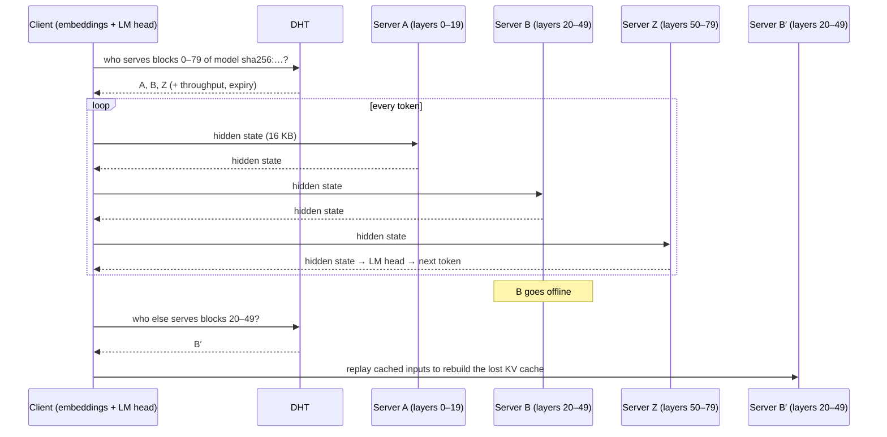

# 2 · Distributed inference

**Verdict:** works today, at interactive-but-slow speeds, for models too big for any single
participant. Latency is the enemy, bandwidth mostly isn't, and the hard engineering is in
*state* (KV caches) and *trust* (honest nodes, private prompts).

## 2.1 How a Petals-style swarm works

[Petals](https://github.com/bigscience-workshop/petals) (Borzunov et al., 2023) is the reference
design. It is built on the [hivemind](https://github.com/learning-at-home/hivemind) library and
its Kademlia DHT:

1. The model is cut into **contiguous blocks of transformer layers**. Each server loads some
   blocks and **announces them in the DHT**: key = `(model, block index)`, value = server
   address, throughput and expiry. Announcements expire, so dead servers fade out of the table.
2. The **client keeps the cheap ends locally**: token embeddings and the LM head. Petals does this
   to save server memory. As a side effect, the first server never sees raw token IDs, although
   it does see their embeddings (§2.7).
3. The client **looks up a route**, a chain of servers covering every block, choosing for
   latency and throughput.
4. For each new token the client **sends the hidden state** through the chain. Each server
   runs its blocks and **keeps the session's KV cache** for its layers.
5. The client **remembers what it sent to each server**. If one disappears, the client finds a
   replacement in the DHT and *replays* those inputs to rebuild the lost KV cache.

Note where the DHT appears: **once per route**, not once per token. It is the control plane.

## 2.2 How fast? (`estimate.py inference`)

70B at int4 is 39.5 GB. Decode reads every weight once per token, so the pure compute time across
consumer GPUs (1 TB/s memory bandwidth) is ~39 ms/token, whether the layers sit in one box or
twenty. On top of that, each hop adds one RTT:

| Hops | metro (5 ms) | continental (30 ms) | transatlantic (80 ms) | global (150 ms) |
|---|---|---|---|---|
| 1 | 22.6 tok/s | 14.4 | 8.4 | 5.3 |
| 2 | 20.3 | 10.1 | 5.0 | 2.9 |
| 4 | 16.9 | 6.3 | 2.8 | 1.6 |
| 8 | 12.6 | 3.6 | 1.5 | 0.8 |
| 16 | 8.4 | 1.9 | 0.8 | 0.4 |

Reading the table:

- A regional swarm of a few large servers lands in the **5–15 tok/s** band, roughly human reading
  speed. Petals reported single-digit tokens per second for 70B-class models, consistent with this.
- A global swarm of many small servers drops below **1 tok/s**. Unusable for chat, but fine for
  batch jobs.
- The fix is topological: **fewer, fatter, closer hops**. Latency-aware routing naturally
  produces regional sub-swarms.

## 2.3 Prefill is where bandwidth bites

Decode ships one 16 KB vector per hop. *Prefill* (processing the prompt) ships one vector per
prompt token: 4,096 tokens × 16 KB ≈ **67 MB per hop**. That takes half a second on symmetric gigabit
and nearly half a minute on a 20 Mb/s upload. Long-context workloads (RAG, documents, codebases)
are therefore bandwidth-bound in a swarm, and favour servers on good uplinks.

## 2.4 State: the KV cache is the swarm's working memory

Every server must hold, for every active session, the keys and values of every previous token
for its layers. For Llama-3-70B (8 KV heads × 128 dims × 80 layers, bf16) that is **~328 KB per
token**, so **2.7 GB for one 8k-token conversation**, spread across the chain.

A worked example: a 24 GB card serving 20 of the 80 layers at int4 uses ~9.9 GB for weights,
leaving ~12 GB for KV at ~82 KB per token for its 20 layers. That is **~146k tokens of context
in total**, roughly 18 simultaneous 8k-token sessions. Server memory, not compute, caps how many
users a swarm can hold.

When a server leaves, its slice of every session's KV cache is gone. Recovery means replaying the
whole conversation prefix through a replacement, a prefill on the critical path. This is the
inference-time version of the *chunk recoherence* problem in
[`4-storage-and-coherence.md`](4-storage-and-coherence.md): state that only makes sense when all
its pieces are present and consistent.

Mitigations: keep warm standby replicas of popular blocks; checkpoint KV caches to a neighbour
(this costs bandwidth); re-send the conversation each turn instead of keeping server state, which
trades compute for privacy and robustness (§2.7).

## 2.5 Speculative decoding: buying back latency

A small **draft model runs locally** (1–8B, on the user's own device) and proposes *k* tokens.
The swarm **verifies all k in one pass**, which costs about the same latency as generating one,
since decode is latency- and memory-bound, not compute-bound. With per-token acceptance rate α,
the expected tokens per swarm round trip is (1 − α^(k+1)) / (1 − α):

| α \ k | 2 | 4 | 8 |
|---|---|---|---|
| 0.5 | 1.75 | 1.94 | 2.00 |
| 0.7 | 2.19 | 2.77 | 3.20 |
| 0.85 | 2.57 | 3.71 | 5.12 |

A 2–4× effective speed-up is realistic. This is probably the single most important trick for
swarm inference, because it attacks the binding constraint directly. Requirements: the draft and
target share a tokenizer, and acceptance depends on how predictable the text is (high for code
and boilerplate, lower for creative writing).

## 2.6 Mixture-of-experts: tempting, but it multiplies hops

MoE models (e.g. DeepSeek-V3: 671B total parameters, ~37B active per token) look ideal for swarms.
They are memory-heavy and compute-light, and experts are natural units to scatter across nodes.
hivemind's original **Decentralized Mixture-of-Experts** (Ryabinin & Gusev, 2020) did exactly
this, looking experts up in the DHT and tolerating missing ones.

The catch is that routing is decided *per token, per layer*. If a token's top-k experts at layer
*i* live on different machines, every MoE layer becomes a network round trip: 60 layers means 60+
hops. Practical swarm placement therefore puts **all experts of a layer block on one node** (or
one regional cluster), which brings back the pipeline structure. MoE helps memory, not latency.

## 2.7 The privacy problem: servers can read your prompt

Whoever computes on your hidden states can, to a large extent, recover what you typed:

- Layer-0 inputs are token embeddings, a fixed lookup table that inverts exactly.
- Deeper hidden states still encode the text. Inversion attacks recover much of the input from
  embeddings and intermediate activations (e.g. *vec2text*, Morris et al., 2023).
- Petals' documentation tells users not to send sensitive data to the public swarm and to run a
  private swarm instead.

There is no cheap cryptographic fix today. MPC runs 7B-scale models at minutes per token, and FHE
is further off still. The practical options are local inference, trusted execution environments,
and keeping the first and last blocks on the client. This is the central technical obstacle for
the privacy goals in [02 / privacy architecture](../02-ethical-llm/4-privacy-architecture.md).

## 2.8 Integrity: servers can lie

A malicious server can return garbage, or *subtly steered* activations that bias the output
(towards an ad, a political line, a backdoor). Defences, roughly in order of cost:

1. **Reputation and stake.** Misbehaviour costs the server something.
2. **Spot checks.** The client recomputes a random block locally from time to time.
3. **Redundancy.** Send the same input to two servers and compare. Floating-point
   non-determinism means the comparison must be approximate unless everyone uses deterministic
   kernels ([`4-storage-and-coherence.md`](4-storage-and-coherence.md) §4.6).
4. **Attestation.** Trusted execution environments prove which code and weights are running.
5. **Proofs.** zkML proofs of inference exist (zkLLM proves a 13B forward pass in under 15
   minutes), but at that cost they suit audits, not chat.

Details in [`5-trust-and-verification.md`](5-trust-and-verification.md).

## 2.9 What would make it better

| Lever | Effect | Status |
|---|---|---|
| Speculative decoding with local draft | 2–4× tok/s | Mature technique; needs swarm support |
| Latency-aware, region-clustered routing | Cuts RTT per hop 3–10× | Petals does a version of this |
| Fatter nodes (multi-GPU home servers, small co-ops) | Fewer hops | Social/economic question |
| Lower-bit weights (int4 → ~2-bit) | Fewer GPUs per model → fewer hops | Quality cost at very low bits |
| Direct server-to-server chaining | ~½ RTT per hop instead of 1 | Trades away the client's fault-tolerance role |
| Multi-token prediction heads | More tokens per traversal | Increasingly standard in new models |
