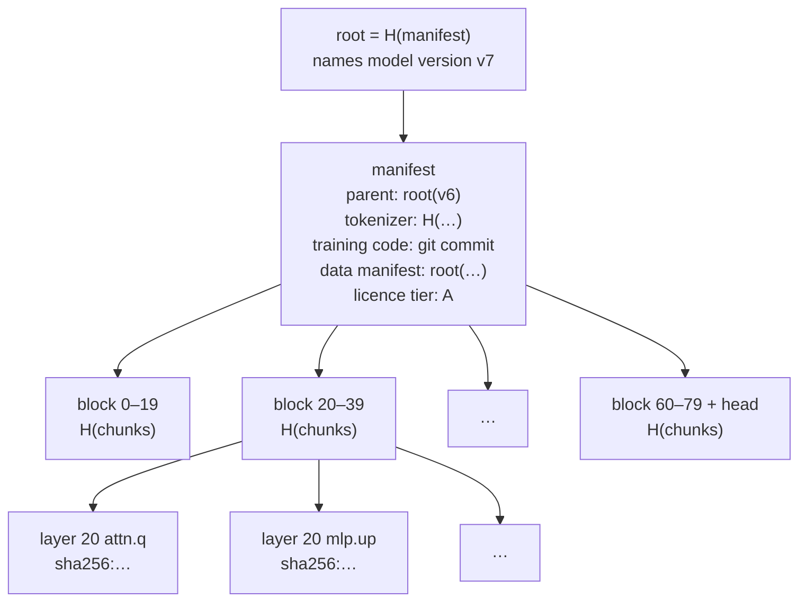

# 4 · Distributed storage and chunk recoherence

**Verdict:** storing and moving the bytes is a solved problem. Content addressing, Merkle trees,
DHT discovery and erasure codes have been proven for two decades by BitTorrent, IPFS, Storj and
Filecoin. **Recoherence**, making sure the pieces a node assembles belong together, is the real
problem. It shows up at several levels, from bytes to versions to live pipeline state, and the
hardest level is social: *which* version is the model?

## 4.1 What has to be stored

| Object | Size (order of) | Lifetime | Access pattern |
|---|---|---|---|
| Released weights | 16 GB (8B bf16) – 810 GB (405B bf16) | Years | Bulk download by servers; must be public for the GPL (see [02](../02-ethical-llm/1-licensing-and-data-tiers.md)) |
| Training checkpoints (+ optimizer state) | ~8× weights | Weeks–months | Written every few hours, read on restart |
| Training data | Common Pile v0.1 is 8 TB of text; frontier corpora are tens of TB | Years | Streamed once per epoch, sharded across replicas |
| Data manifest (hash + licence + source per document) | GBs | Forever | Audits, attribution, licence-tier filtering |
| KV caches | GBs per active session | Minutes | Hot, latency-critical, lost on failure (§4.5e) |

Moving the bytes once (`estimate.py storage`):

| Model | bf16 @ 1 Gb/s | bf16 @ 100 Mb/s | int4 @ 1 Gb/s | int4 @ 100 Mb/s |
|---|---|---|---|---|
| 8B | 2 min | 21 min | 36 s | 6 min |
| 70B | 19 min | 3.1 h | 5 min | 53 min |
| 405B | 1.8 h | 18 h | 30 min | 5 h |

Swarming (BitTorrent-style, downloading different chunks from many peers at once) makes the
uploader's link stop mattering once a model is popular. Getting the weights onto a new server is a
one-off cost measured in minutes to hours, not an ongoing bottleneck.

## 4.2 Name chunks by what they are, not where they are

**Content addressing:** a chunk's name *is* its cryptographic hash. Any peer can serve any chunk,
and the receiver verifies it independently, so an untrusted network becomes a trustworthy store.
Arrange the hashes in a **Merkle tree** and a *single root hash* names an entire model version,
the way a git commit names a source tree.



Design choices that matter:

- **Chunk on tensor (or layer-block) boundaries**, so a server serving layers 20–39 fetches
  exactly those chunks and nothing else.
- **Content-defined chunking** (as in Hugging Face's Xet storage) means a fine-tune that changes
  1% of weights shares ~99% of its chunks with the parent: storage and transfer deduplicate for
  free.
- **The manifest links to its parent**, so the version history is itself a hash chain: an
  append-only, tamper-evident lineage, with no blockchain required.

Prior art: BitTorrent v2 (per-file SHA-256 Merkle trees), IPFS (CIDs over a Merkle DAG), git.

## 4.3 Finding chunks: the DHT's proper job

**Kademlia** (Maymounkov & Mazières, 2002) is the workhorse: node IDs and keys share one ID
space, distance is XOR, each node keeps *k*-buckets of contacts (k = 20 is typical), and a lookup
converges in O(log n) steps with α parallel queries. A key's value lives on the *k* nodes closest
to it, and records carry TTLs and get republished to survive churn.

On public DHTs, lookups take **hundreds of milliseconds to seconds**: several sequential round
trips, plus timeouts on dead contacts (measurement studies of IPFS's DHT, e.g. Trautwein et al.,
SIGCOMM 2022, find second-scale lookup times). That is perfectly adequate for:

- `model/<root>/block/<i>` → which servers serve this block of this exact version
- `chunk/<hash>` → which peers hold this chunk
- `peer/<id>` → address, region, measured throughput, reputation

…and useless for anything on the per-token critical path. The DHT is the **phone book**, not the
**phone line**.

## 4.4 Keeping chunks alive under churn

Volunteer nodes are online intermittently. Say each is online with probability *p*. A model of
1,400 chunks (a 140 GB checkpoint in 100 MB chunks) is usable only if **every** chunk is
recoverable. From `estimate.py storage`, each cell gives *P(one chunk unrecoverable) /
P(whole model recoverable right now)*:

| Scheme (storage overhead) | p = 0.5 | p = 0.8 | p = 0.95 |
|---|---|---|---|
| 3× replication | 1.2e-1 / 0.000 | 8.0e-3 / 0.000 | 1.3e-4 / 0.839 |
| 5× replication | 3.1e-2 / 0.000 | 3.2e-4 / 0.639 | 3.1e-7 / 1.000 |
| Reed–Solomon RS(10, 30) (3×) | 2.1e-2 / 0.000 | 4.5e-9 / 1.000 | 4.4e-21 / 1.000 |
| RS(10, 40) (4×) | 3.4e-4 / 0.621 | 8.5e-15 / 1.000 | 8.1e-33 / 1.000 |
| RS(29, 80) (2.8×, Storj's shape) | 4.8e-3 / 0.001 | 2.9e-18 / 1.000 | 1.6e-47 / 1.000 |

Lessons:

- **Many chunks punish small per-chunk risks**: (1 − ε)^1400 collapses fast. Plain replication
  is hopeless at volunteer uptime.
- **Erasure codes win at equal storage overhead**. At p = 0.8, RS(10, 30) is a million times safer
  per chunk than 3× replication for the same 3× bytes.
- **At p ≈ 0.5, nothing cheap works.** Keep a core of reliable, always-on nodes (co-ops,
  universities, mirrors, as Debian and the Internet Archive do) and treat volunteers as bonus
  capacity.
- **Repair costs bandwidth.** Rebuilding one lost RS shard means downloading *k* others.
  Regenerating codes and locally repairable codes cut this, and they matter when churn is
  constant.
- **Availability ≠ durability.** A chunk can be temporarily unreachable (owner asleep) yet safe.
  Filecoin-style proofs of storage give economic guarantees that the bytes still exist.

## 4.5 Recoherence, level by level

"Chunk recoherence" breaks into distinct problems, from easy to hard:

**(a) Byte coherence: is this chunk intact?** Solved: check its hash.

**(b) Version coherence: do these chunks belong to the same model?** Solved, provided you
assemble by root hash and never by "latest". Every DHT key and every route includes the root.

**(c) Canonicality: which root hash *is* the model right now?** Not a storage problem but a
**consensus** problem, and the bridge to governance. Options, from most to least centralised:

| Mechanism | Trust | Notes |
|---|---|---|
| One maintainer's signature | One key | Simple; single point of capture or coercion |
| k-of-n threshold signature by elected maintainers | k honest keyholders | Debian/Tor-like; pairs with a post-quantum threshold scheme |
| Transparency log (Certificate Transparency / Sigstore Rekor style) | Witnesses detect equivocation | Append-only and auditable without a token |
| On-chain registry updated by governance vote | The chain's consensus + vote integrity | Natural fit with [the constitution](../02-ethical-llm/2-free-speech-and-democratic-constitution.md) |
| Social consensus / forks | Users choose | What actually happens in free software anyway |

**(d) Pipeline coherence: do all stages of a route run the same version?** During inference, if
server A runs layers 0–19 of v7 and server B runs 20–39 of v8, the hidden states exchanged
between them mean different things and the output is garbage, *silently*. Routes must be
**version-pinned** (the root is in the DHT key). During pipeline *training*, stages update at
different moments, so a micro-batch can see a mix of versions. PipeDream's *weight stashing*
(Narayanan et al., 2019) and SWARM's design handle this explicitly.

**(e) Session coherence: can a conversation survive a node leaving?** The KV cache is state that
only makes sense together with its siblings on other servers. Recovery is by replay
([`2-inference.md`](2-inference.md) §2.4); prevention is by checkpointing to neighbours.

**(f) Training coherence: can drifting replicas be reconciled?** DiLoCo replicas *intentionally*
diverge for H steps, then the outer step recoheres them. A replica that returns late carries a
pseudo-gradient computed from an old version. Accept it with staleness weighting, or drop it.
Async methods differ mainly in how they answer that question.

**(g) Data coherence: which shards were trained on, by whom, under which licence?** This needs an
append-only record of shard hash → replica → step. It matters for correctness (no double-counting
or skipping) and for the ethical project: proving that a tier-A model saw *only* tier-A data
([02 / licensing](../02-ethical-llm/1-licensing-and-data-tiers.md)).

## 4.6 The quiet saboteur: floating-point non-determinism

Floating-point addition is not associative. GPU kernels reorder reductions depending on hardware,
library version, and even **batch size** (the kernel chosen changes with the shape). So:

- The "same" computation on two nodes yields **bitwise different** results, and hash comparison
  can't verify someone else's work.
- Training runs are not bitwise reproducible, so "Corresponding Source" (data + code) regenerates
  a model that is *statistically* equivalent, not *identical*. The GPL argument in
  [02](../02-ethical-llm/1-licensing-and-data-tiers.md) has to accept that.

Fixes exist and cost some speed: **batch-invariant, deterministic kernels** (Thinking Machines Lab,
"Defeating Nondeterminism in LLM Inference", 2025), Gensyn's **RepOps** (bitwise-reproducible
operators across hardware, used for verification), and integer or fixed-point arithmetic on
verification paths.

## 4.7 Design sketch

```
version manifest (JSON, hashed → root)
├── parent: <root of previous version>
├── tensors: { name → [chunk hashes], dtype, shape, layer-block }
├── tokenizer: <hash>
├── training: { code: <git commit>, config: <hash>, seed, data_manifest: <root> }
├── licence_tier: A | B | C
└── signatures: threshold signature (post-quantum) from ratified maintainers

DHT keys
├── model/<root>/block/<i>  → serving peers (TTL 5 min)
├── chunk/<hash>            → providers (TTL 24 h)
└── peer/<id>               → address, region, throughput, reputation

storage tiers
├── hot:  replicated full blocks on serving nodes (inference)
├── warm: BitTorrent-style swarm for new servers joining
└── cold: RS-coded checkpoints + data on reliable core nodes

registry
└── append-only log: version number → root, witnessed; optionally anchored on-chain
```
