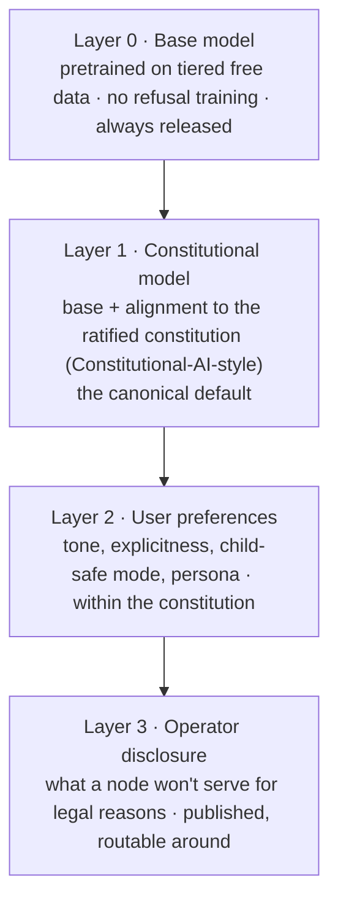

# 2 · Free speech and a democratic alignment constitution

**The design goal:** an uncensored model whose behaviour is set by a written constitution that its
community can amend democratically, without a company, state or founder deciding what people
may ask.

**The obvious tension:** if a majority can amend the constitution, a majority can vote in
censorship. This document resolves that with four mechanisms: **layering** (alignment is a
default, never a lock), **entrenchment** (the free-speech core is hard to amend), **transparency**
(every limit is written down and cited when used), and **forkability** (the GPL lets any minority
leave with everything).

## 2.1 What "uncensored" means here

- **No hidden refusals, no silent steering.** If the model declines something, it says so and
  cites the article. It never pretends not to know, never quietly waters an answer down, and
  never pushes an ideology the user didn't ask for.
- **Adults may explore anything as speech:** politics, religion, sexuality, drugs, violence in
  fiction, dark history, contested science, blunt criticism of anyone, including this project.
- **Every limitation is written, narrow and cited.** Nothing restricts behaviour unless it is in
  the ratified constitution, and every restriction carries its justification and a sunset date.
- **Users set their own defaults** within the constitution: tone, explicitness, a child-safe mode
  a parent turns on for their own device.
- **Speech vs. operational uplift.** Whether *any* carve-outs exist is for the founding assembly to
  decide (draft Article 5 lists the candidates). The usual line is between *ideas and information*
  (always allowed) and *step-by-step operational capability* for irreversible harm to people who
  did not consent (weapons capable of mass casualties, sexual content involving minors, doxxing a
  private person).

Two honest technical facts frame all of this:

1. **Open weights cannot be policed.** Refusal behaviour in LLMs is largely mediated by a single
   direction in activation space and can be removed cheaply ("abliteration"; Arditi et al., 2024),
   or fine-tuned away. The constitution therefore governs **the canonical model and what the
   project's swarm serves under its name**, not forks. That is a feature: the constitution sets
   the commons' shared *defaults* and is not a policing tool.
2. **Node operators live under real laws.** Some content (CSAM above all) is illegal almost
   everywhere, and an operator cannot vote their own liability away. The constitution can require
   operators to *disclose* what they won't serve, so routing can go elsewhere, but it cannot make
   them break their local law.

## 2.2 Layered alignment

Releasing Layer 0 alongside Layer 1 is itself a free-speech guarantee: anyone who rejects the
constitution's defaults already holds the unaligned base.

## 2.3 Who votes? The demos

| Option | Pros | Cons |
|---|---|---|
| Every unique human who joins | Most democratic | Needs global Sybil resistance; open to brigading |
| Active users only | People affected decide | "Active" is gameable; it excludes the curious |
| Contributors only (data, compute, code, review) | Expertise, skin in the game (Debian model) | An oligarchy of the technically able |
| **Bicameral: People's Assembly + Contributors' Council (proposed)** | Each chamber checks the other's failure mode | More process |

The proposal: **ordinary articles need a majority in both chambers; entrenched articles need a
supermajority in both, twice.** Switzerland's double majority (people *and* cantons) is the
inspiration.

## 2.4 One person, one vote, without revealing who you are

The hardest part, and it overlaps with the privacy design
([`4-privacy-architecture.md`](4-privacy-architecture.md)):

| Proof of personhood | How | Privacy | Weakness |
|---|---|---|---|
| Pseudonym parties (Borge et al., 2017) | Everyone attends a physical event at the same moment and receives one token | Strong | Logistics; excludes people who can't travel |
| Social vouching (BrightID-style) | Existing members vouch; graph analysis finds Sybil clusters | Medium | Collusion rings; excludes the socially isolated |
| Zero-knowledge proof over a government ID | Prove "a valid passport I haven't used before" via a nullifier, revealing nothing else | Strong (cryptographically) | Excludes the stateless; trusts state PKIs; current schemes aren't post-quantum |
| Biometrics (iris, as in World ID) | A device checks uniqueness | Weak to medium | Coercion, central hardware, irreversibility |

Recommendation: **plural identity**. Accept several mechanisms, each with its own zero-knowledge
nullifier so nobody registers twice through the same one. Run periodic re-verification and treat
the voter roll as an open research problem rather than pretending it's solved.

**Ballot privacy and anti-coercion.** Votes must be secret, and *receipt-free* (you can't prove
to a briber how you voted). **MACI** (Minimal Anti-Collusion Infrastructure, Buterin 2019) lets
voters secretly change their key, so bought votes can't be verified. Its coordinator can see
votes (but can't forge results), and today's MACI uses pairing-based SNARKs that are not
post-quantum, so a STARK-based or lattice-based variant is needed.

## 2.5 Deliberation before voting

Raw majority votes on a complicated text produce slogans. Three proven deliberative tools:

- **Polis** opinion mapping: participants write and vote on short statements, the system clusters
  opinion groups and surfaces *bridging* statements that win across groups. It was used by
  vTaiwan, and by Anthropic and the Collective Intelligence Project for Collective
  Constitutional AI (2023).
- **Citizens' assemblies by sortition**: a randomly selected, demographically balanced group
  (~150 people) deliberates for weeks with expert input and drafts proposals. Ireland's
  Constitutional Convention and Citizens' Assembly prepared the 2015 marriage-equality and 2018
  abortion referendums this way. Random selection is also robust to Sybils and brigading: you
  can't campaign your way into a lottery.
- **Liquid delegation**: members may delegate their vote, by topic and revocably, to someone they
  trust (LiquidFeedback; the German Pirate Party). It addresses low turnout without creating
  permanent representatives.

## 2.6 The amendment cycle

```mermaid
flowchart LR
    P["Proposal<br/>(N co-sponsors, or<br/>the sortition assembly)"] --> D["Deliberation ≥ 30 days<br/>Polis map + assembly report"]
    D --> I["Impact statement<br/>training changes,<br/>test-suite changes"]
    I --> V["Vote · Schulze method<br/>both chambers · quorum"]
    V -->|ordinary: ⅔ / ⅔| T["Train constitutional<br/>model on new text"]
    V -->|entrenched: ¾ / ¾,<br/>twice, ≥ 6 months apart| T
    T --> Q["Constitutional test suite<br/>per-article evals, public scores"]
    Q -->|pass| R["Registry update<br/>threshold-signed root hash"]
    Q -->|fail| T
```

- **Voting method:** Schulze (Condorcet), as Debian uses for General Resolutions. It handles many
  options without spoilers.
- **Entrenchment, not eternity.** Germany's Basic Law makes some articles unamendable (Art. 79(3)).
  This draft makes the free-speech, privacy and software-freedom articles *hard* but not
  impossible to amend. The final safeguard is forkability, not a clause.
- **Sunsets on restrictions.** Every carve-out expires after a fixed term unless re-ratified, so
  the burden of proof stays permanently on restriction.
- **Exit as the backstop.** A minority that loses can fork the code, weights, data and
  constitution and keep going. Exit guarantees voice (Hirschman, *Exit, Voice, and Loyalty*,
  1970). Sections 2.8 and 2.9 ask how forks can keep sharing infrastructure.

## 2.7 From text to weights

- **Constitutional AI** (Bai et al., 2022): the model critiques and revises its own outputs against
  written principles, and the revisions train a preference model (RLAIF). The constitution text
  is *literally* the training signal.
- **Collective Constitutional AI** (Anthropic & CIP, 2023; FAccT 2024): about 1,000 representative
  US adults drafted principles through Polis. A model trained on that public constitution
  performed comparably on standard benchmarks and showed less bias on some measures. That is
  evidence the pipeline from public input to constitution to model works.
- **Constitutional test suite:** every article has public evaluation prompts and expected
  behaviours. Members can add cases through governance, and every release publishes per-article
  scores. A release that regresses on an entrenched article cannot be signed.
- **Complaints with proof:** a user can *voluntarily* disclose a transcript plus the node's signed
  receipt ([`4-privacy-architecture.md`](4-privacy-architecture.md) §4.8) to prove the canonical
  model said something unconstitutional. It becomes a regression test.
- **Alignment data is Corresponding Source** ([`1-licensing-and-data-tiers.md`](1-licensing-and-data-tiers.md)):
  anyone can inspect exactly how the constitution was turned into weights.

## 2.8 Failure modes and safeguards

| Failure mode | Safeguard |
|---|---|
| Tyranny of the majority | Entrenchment, bicameralism, sunsets on restrictions, forkability |
| Capture by an organised faction or brigade | Sortition assemblies, deliberation periods, Sybil resistance |
| Plutocracy | No token-weighted voting, ever |
| Vote buying and coercion | MACI-style receipt-freeness |
| Low turnout | Revocable liquid delegation; quorums |
| Founders' lock-in | A founding assembly ratifies v1; founding provisions expire |
| Constitution drift (behaviour ≠ text) | Public per-article test suite; complaint-to-test pipeline |
| Legal pressure on operators | Jurisdictional diversity; mandatory operator disclosure; routing around |
| Forks splitting the swarm | Shared data and storage layers are constitution-neutral; only the alignment layer forks |

## 2.9 Open questions

- Should the **base model (Layer 0)** be governed at all, or always be "whatever the free data
  says"?
- Is bicameralism worth the complexity, or does sortition plus a single chamber suffice?
- What is the minimum viable voter roll for the **founding** vote, before any privacy-preserving
  personhood scheme exists?
- How should the constitution treat **non-users affected by outputs**, such as people discussed,
  depicted or targeted? They don't vote, but they bear consequences.
- Should forks that keep the entrenched articles stay in a "constitutional federation" sharing
  compute, while forks that drop them leave the federation?
