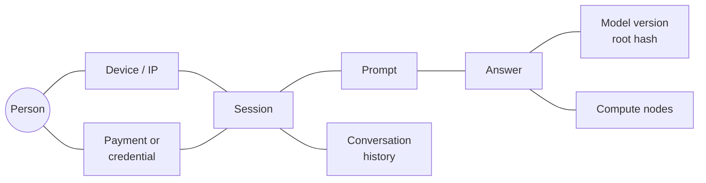
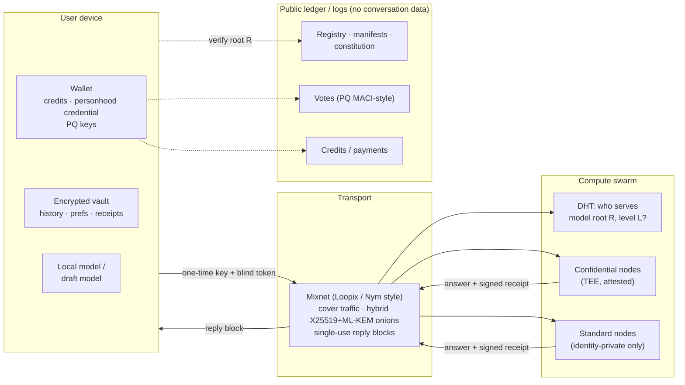

# 4 · Privacy architecture: Monero-grade, post-quantum

**Goal:** nobody except the user can link *person → prompt → answer → conversation → model
version*. That includes the project itself, the nodes doing the compute, network observers, and
a quantum-equipped adversary decades from now.

**Three findings shape the design:**

1. **Monero's privacy toolkit is the right model, but Monero itself is not quantum-resistant.** All
   its primitives fall to Shor's algorithm, some of them *retroactively*. Each needs a
   post-quantum replacement (§4.4–4.5).
2. **Conversation data should never touch a blockchain, not even encrypted.** A public ledger is
   permanent, so every future break of its cryptography exposes the past. The ledger belongs to
   *public* things (registry, votes, payments). Conversations stay on the user's device (§4.6).
3. **Identity privacy is achievable today; content privacy is not, except locally or in TEEs.**
   The nodes that run the model see its activations, which reveal the prompt. Cryptographic fixes
   (MPC, FHE) are orders of magnitude too slow (§4.7).

## 4.1 The linkage graph we must break

Everyone except the user should see only disconnected fragments. Links the *user* can choose to
reveal (for example to prove that the canonical model said something; §4.8) must be revealable
without exposing the others.

## 4.2 Adversaries

| Adversary | Sees | Wants |
|---|---|---|
| Network observer (ISP, state, global passive adversary) | Packets, timing, sizes | Who talks to the model, when, how much |
| Compute node (curious or malicious) | Hidden states for its layers | Prompt content; correlation across sessions |
| Ledger analyst | Everything ever written on-chain | Payment ↔ usage ↔ identity links |
| Project insiders and maintainers | Infrastructure, logs if any exist | Anything, under pressure or by choice |
| Legal compulsion (subpoena, gag order) | Whatever anyone *holds* | User records. The defence is to hold nothing. |
| **Future quantum adversary** | Everything recorded today | Harvest now, decrypt (or deanonymise) later |
| Abusive client | Its own access | Spam, denial of service, free-riding |

## 4.3 What "Monero-grade" means, mapped to this problem

| Monero primitive | What it hides there | Analogue here |
|---|---|---|
| **Stealth (one-time) addresses** | The receiver: outputs can't be linked to a public address | Fresh keys per session and a one-time reply address per answer |
| **Ring signatures (CLSAG) → FCMP++** | Which coin is spent: among 16 decoys, or among the whole chain with full-chain membership proofs (the 2025–26 upgrade) | Anonymous credentials: prove "I hold a valid credit / personhood credential" among *all* of them |
| **Key images** | Prevent double spends without revealing which coin | **Nullifiers:** one vote per person, rate limits, without identity |
| **RingCT (Pedersen commitments + Bulletproofs+)** | Amounts | How much compute a user buys |
| **Dandelion++** | The IP that originated a transaction | A mixnet for requests and replies (§4.9) |
| **Privacy by default** | Everyone shares one anonymity set | No opt-in "private mode" that marks its users as interesting |

The last row is the most important lesson. Where privacy is optional (as with Zcash's optional
shielded pool), the private set stays small and stands out. Here, every request gets identity
privacy, always.

## 4.4 Why Monero is not quantum-resistant

All of Monero's privacy rests on the discrete-log problem over Ed25519, which Shor's algorithm
solves. A large quantum computer could then:

- **Deanonymise ring signatures retroactively.** It computes the private key of every ring member,
  derives each one's key image, and matches it against the published one, revealing the true
  spender in historical transactions.
- **Unmask stealth outputs.** From a known public address it derives the private view key and scans
  the chain for every output that address ever received.
- **Forge amounts.** Pedersen commitments are *perfectly hiding*, so past amounts stay secret, but
  only *computationally binding*, so a quantum attacker could create money from nothing.

FCMP++ is also elliptic-curve based. Its companion address scheme (Carrot) reportedly adds some
forward secrecy for users whose addresses an attacker doesn't know, but that does not make it
post-quantum. **Lesson for this project:** anything *public* (a ciphertext, signature, proof or
commitment) should be assumed to face a quantum attacker eventually. Make public artefacts
post-quantum, or don't publish them.

## 4.5 The post-quantum toolbox

| Need | Classical today | Post-quantum option | Status (late 2026) |
|---|---|---|---|
| Key exchange / encryption | X25519 | **ML-KEM** (FIPS 203, Aug 2024), deployed as **hybrid X25519 + ML-KEM** | Deployed: TLS in major browsers, Signal (PQXDH, 2023), Apple iMessage (PQ3, 2024) |
| Signatures | Ed25519 (64 B) | **ML-DSA** (FIPS 204, ~2.4–3.3 KB), **SLH-DSA** (FIPS 205, hash-based, conservative), FN-DSA / Falcon (being standardised) | Standardised; signatures ~50× larger |
| Symmetric crypto, hashing | AES, ChaCha20, SHA-2/3 | The same at 256-bit (Grover only halves security) | Fine |
| Anonymous membership (ring-signature / FCMP analogue) | CLSAG, FCMP++ | Lattice-based: **MatRiCT / MatRiCT+** (Esgin et al., 2019/2022), **SMILE** (Lyubashevsky et al., 2021); or hash-based STARK proofs of membership in a Merkle tree | Research to prototype; proofs of tens of KB |
| General zero-knowledge proofs | Groth16, PLONK, Halo2 (elliptic-curve, *not* PQ) | **zk-STARKs** (hash-based), lattice SNARKs | STARKs in production; ~100 KB proofs |
| Anonymous tokens (rate limits, credits) | Privacy Pass (RFC 9576–9578; VOPRF, blind RSA) | Lattice-based blind signatures and anonymous credentials | Research |
| Hiding commitments | Pedersen (perfectly hiding) | Lattice commitments (can be statistically hiding); hash commitments (only computationally hiding) | Prefer *statistically hiding*, so hidden values survive future attacks |

Costs to plan for: kilobyte-scale signatures and proofs, larger handshakes, and slower
verification. Fine for requests and votes; a real constraint for anything replicated on a ledger.

## 4.6 The key design decision: what goes on a ledger

The founding brief asked for the user-to-answer linkage to be protected *"through a
Monero-grade, quantum-resistant blockchain architecture."* Taking the *goal* (unlinkability)
seriously leads to a sharper rule:

> **Nothing about a conversation (no ciphertext, hash, size or timestamp) is ever written to a
> shared ledger.**

Why:

1. **Permanence.** A ledger is replicated forever. Any future break, by quantum computer or by an
   implementation bug, exposes *everything ever written*. "Harvest now, decrypt later" becomes
   "harvest always".
2. **Metadata.** Even perfect encryption leaks timing, size and frequency, and traffic analysis
   links sessions from those alone.
3. **No need.** Only one party ever needs the conversation: the user. It lives in an encrypted
   vault on their device, optionally synced (still encrypted) to storage they choose.
4. **Law and kindness.** The right to erasure (GDPR Art. 17), or simply changing your mind, is
   impossible on an immutable ledger.

What the shared ledger *is* for: public facts that need tamper-evidence and no single owner.

| Record | Needs permissionless ordered writes? | Suitable structure |
|---|---|---|
| Model registry (version → root hash, threshold-signed) | No | Transparency log (Certificate Transparency / Sigstore style) |
| Data manifests and the tier ledger | No | Transparency log |
| Constitution texts and amendment history | No | Transparency log |
| Operator disclosures and reputation | Somewhat | Log or chain |
| **Votes** (encrypted, receipt-free, tallied with proofs) | **Yes** | Blockchain or bulletin board with PQ MACI-style protocol |
| **Compute credits and payments** (private) | **Yes** | PQ privacy chain (Monero design, lattice/STARK primitives), or non-transferable blind-signed credits with no chain at all |

So "blockchain" shrinks to two jobs, **votes and payments**. Everything else is better served by
witnessed append-only logs that need no token and no mining.

## 4.7 The hard problem: nodes see the activations

Whoever runs a layer sees its input hidden state, and hidden states can be inverted back to text
([01 / §2.7](../01-distributed-feasibility/2-inference.md)). That gives two separate properties:

- **Identity privacy:** the node doesn't know *who* sent the request. **Achievable today**
  (mixnet + anonymous credential), the way a Tor exit relay sees traffic but not its origin.
- **Content privacy:** the node doesn't know *what* was asked. Achievable only as follows:

| Level | How | Content hidden from nodes? | Overhead | Status |
|---|---|---|---|---|
| **Local** | Run the model on your own device or home cluster | ✅ Perfectly | Your hardware; quality capped by model size | Today |
| **Confidential** | Nodes run inside a TEE (GPU confidential computing, H100 and later); client verifies attestation of code + weights root before sending | ✅ If the chip vendor and hardware are trustworthy | A few % | Shipping; side-channel and vendor-trust caveats; attestation keys not yet PQ |
| **Split** | Client runs embeddings and the first/last few layers | 🟡 Partly; middle states still invertible | Client compute | Today; weak |
| **Scatter** | Spread one conversation's layers and turns across many unrelated nodes behind a mixnet | 🟡 Statistically, against non-colluding nodes | Latency | Research idea |
| **MPC** | Secret-share activations across 2–3 non-colluding servers | ✅ Unless they collude | ~Minutes per token at 7B (PUMA, 2023) | Research |
| **FHE** | Compute directly on encrypted activations | ✅ Cryptographically | 10⁴–10⁶× | Research; small models only |

**Honest conclusion:** Monero-grade *identity* unlinkability is achievable today at every level.
Monero-grade *content* confidentiality exists today only locally or in TEEs. So every request
carries a declared privacy level, and the draft constitution (Art. 2.3) requires that it be
disclosed. The swarm's latency problems and this privacy problem share a solution: **make
local inference as capable as possible**, with the swarm as the fallback.

## 4.8 Accountability without linkability

- **Signed receipts.** With each answer, the node returns `ML-DSA-sign(H(prompt ‖ answer ‖
  model_root ‖ nonce))`, and only the user receives it. Later, the user can disclose `(prompt,
  answer, receipt)` to prove "canonical model version X said this" (for a constitutional
  complaint, Art. 11.4) without revealing who they are.
- **Abuse resistance without identity.** Anonymous credits, either paid or earned by contributing
  compute, are spent as blind-signed one-time tokens. Rate-limiting nullifiers (RLN-style) cap
  requests per epoch per credential. Post-quantum versions of both are research items.
- **Weights linkage.** The receipt binds answer → model root. The model root is public. Nothing
  binds either to the person.

## 4.9 Architecture sketch

**Why a mixnet and not Tor:** Tor adds no cover traffic or mixing delays, so a global passive
adversary can correlate a stream's entry and exit timing. Loopix-style mixnets (Piotrowska et al.,
USENIX Security 2017; deployed by Nym) add Poisson-distributed delays and cover traffic, and
resist that adversary at the cost of hundreds of milliseconds to seconds. For chat that is
tolerable if answers come back in **chunks** rather than token by token. Once again latency (see
[01](../01-distributed-feasibility/1-physics-of-information.md)) is the currency privacy is paid in.

**Multi-turn conversations:** either
(a) the client **re-sends the history each turn**: no server state and the best privacy, but
re-prefill costs compute; or
(b) the node keeps a KV cache under a **one-time session pseudonym** for a few minutes: faster, and
it links the turns of one session at one node only.
Default: (a) for confidential and local levels, with the user's choice at the standard level.

## 4.10 Open questions

- **Post-quantum MACI.** Can receipt-free, coercion-resistant voting be built from STARKs or
  lattices with practical proof sizes?
- **Post-quantum anonymous credentials at scale.** Lattice blind signatures and credentials are
  still research. Which construction is closest to deployable?
- **TEE trust.** Attestation roots belong to a few chip vendors. Can attestations from *several*
  vendors be combined so that no single vendor is trusted?
- **Scatter routing.** How much does spreading layers and turns across non-colluding nodes actually
  leak? It needs a formal model.
- **Payments.** Use Monero itself now (private, not PQ), or wait for a PQ privacy chain, or avoid
  money entirely with contribution-earned credits?
- **Local first.** How large a model can a typical household run by 2028, and what share of
  requests could never leave the device?
