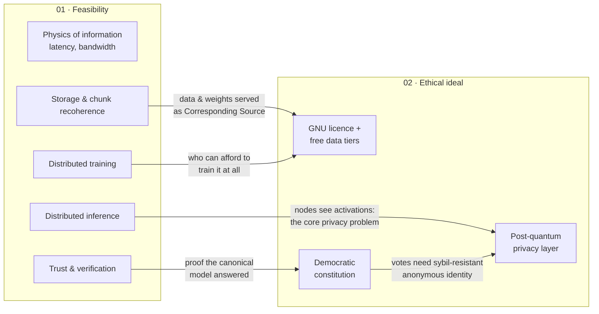

# Decentralized LLMs & the Ethical Model Ideal

An open notebook on two linked questions:

1. **Can a large language model be trained and run without a data center?** Could it run on a
   swarm of ordinary machines tied together by a DHT or a similar peer-to-peer scheme? What do
   physics, bandwidth and churn actually allow?
2. **What would an ethical LLM look like if we started from first principles?** That means free
   software, free data, free speech, democratic alignment, and privacy that holds up even against
   a quantum computer.

The two questions feed each other. The ethical ideal needs a substrate that no single company,
state or foundation controls, and decentralization is the obvious one. The feasibility study
says how much of that substrate exists today and how much is still wishful thinking.

## Layout

| Folder | Question | Start with |
|---|---|---|
| [`01-distributed-feasibility/`](01-distributed-feasibility/) | Feasibility of DHT-style distributed training and inference: compute, speed of information, chunk recoherence, trust | [README](01-distributed-feasibility/README.md) |
| [`02-ethical-llm/`](02-ethical-llm/) | The ethical model: GNU licensing, licence-clean data tiers, uncensored speech under a democratic constitution, and post-quantum, Monero-grade privacy | [README](02-ethical-llm/README.md) |
| [`IDEAS.md`](IDEAS.md) | Inbox for new ideas before they get a home | — |

## How the two halves connect

## Status

Early exploration, started October 2026. Everything here is a working draft that is meant to be
argued with. Numbers come from [`01-distributed-feasibility/estimate.py`](01-distributed-feasibility/estimate.py),
so anyone can change an assumption and re-run it. Factual claims cite their source. Where I'm
unsure, or the field moves fast, the text says so.
